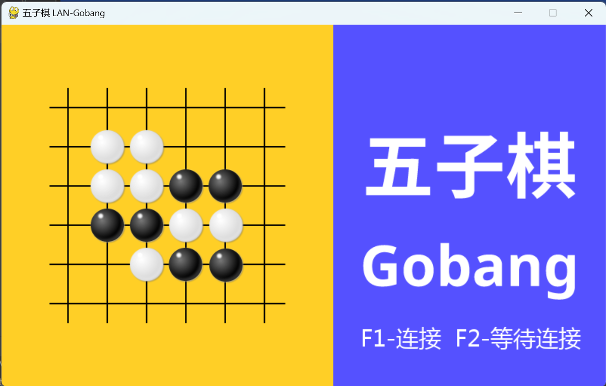

# LAN-Gobang

**五子棋联机**、**联机**、**局域网**

联机五子棋对战游戏，使用python编写。

## 效果



## 下载方式

可执行文件：
https://github.com/keyblues/LAN-Gobang/releases

源代码可clone使用，体积更小

## 游玩方法

源代码版本使用前请安装相应的包

```pip install -r requirements.txt```

船新版本，两端合并，用同一个客户端就可以实现两端联机

本游戏可跨平台对战，例如linux端可和windows端对战

## 博客

**https://www.keyblue.cn**
